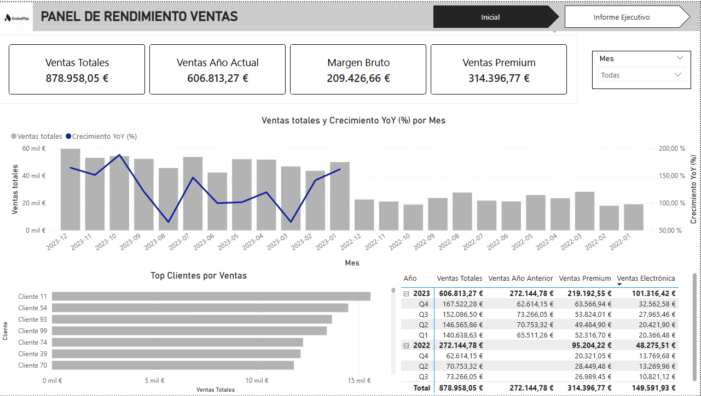
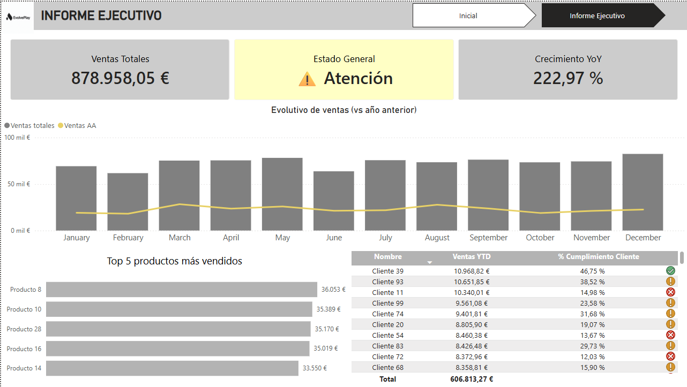

# 📊 Power BI - Dashboard de Ventas

## 📌 Descripción

He analizado y visualizado los datos mediante Power BI enfocándome en el rendimiento de ventas.

El objetivo es transformar los datos, crear métricas clave (KPIs) y construir un dashboard interactivo que permita analizar la evolución de las ventas y apoyar la toma de decisiones.

---

## 🛠️ Tecnologías utilizadas

- Power BI  
- Power Query  
- DAX  

---

## 📂 Estructura del proyecto

- dashboard_ventas.pbix

- images/
    - dashboard_1.png
    - dashboard_2.png

- README.md

---

## 🔍 Análisis realizado

### 1. Transformación de datos
- Limpieza de datos mediante Power Query  
- Estandarización de formatos  
- Preparación del dataset para análisis  

### 2. Modelado y métricas
- Creación de medidas en DAX  
- Cálculo de KPIs clave

### 3. Visualización
- Dashboard interactivo con indicadores clave para poder ver el rendimiento de la empresa

---

## 📊 Resultados

- Visualización clara del rendimiento de ventas  
- Identificación de clientes con mayor volumen de ventas  
- Análisis de tendencias temporales y crecimiento  
- Soporte a la toma de decisiones basada en datos  

---

## 🚀 Objetivo

Aplicar un flujo completo de análisis y visualización de datos en Power BI:

- Transformación de datos  
- Creación de métricas (DAX)  
- Visualización e interpretación de resultados  

## 📷 Vista del dashboard

